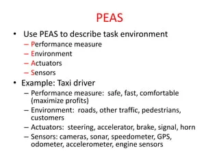
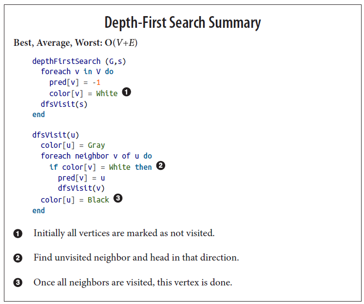
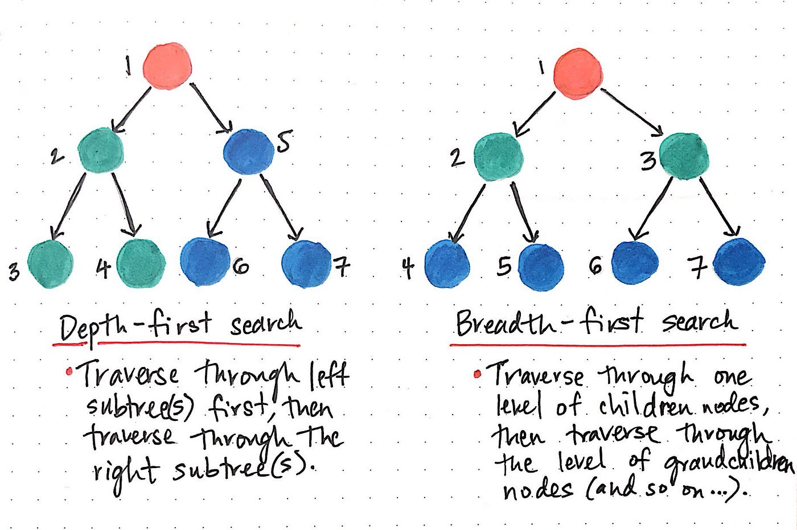
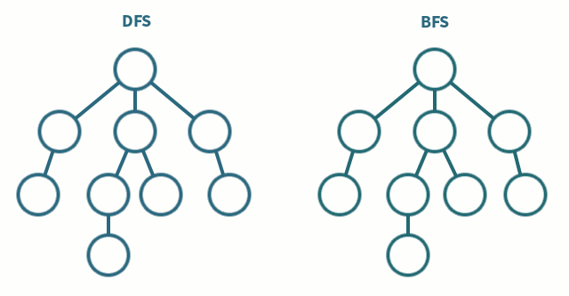
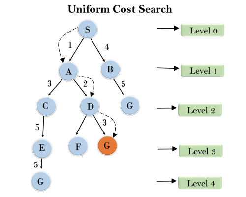
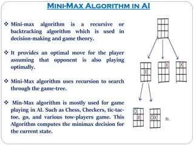
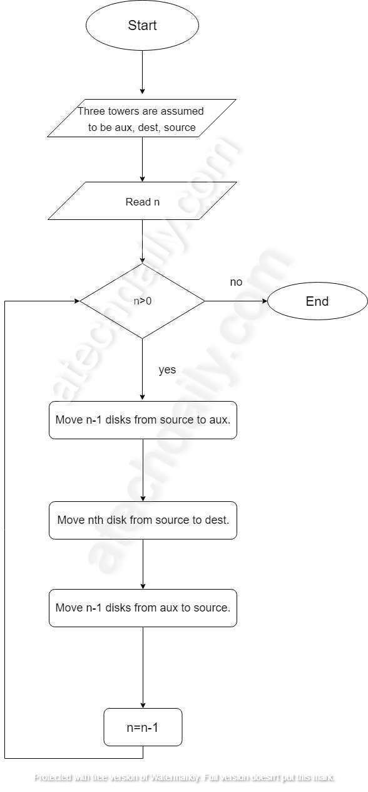

## PEAS , Performance measure, Environment, Actuator, Sensor. 


----------------------------------------------------------------------------


## Types of agents




----------------------------------------------------------------------------


# Search algorithms


## DLS

The depth-limited search (DLS) method is almost equal to depth-first search (DFS), but DLS can work on the infinite state space problem because it bounds the depth of the search tree with a predetermined limit L. Nodes at this depth limit are treated as if they had no successors.

## IDDLS


## Random Search , 

```
# random search function
def random_search(g,alpha_choice,max_its,w,num_samples):
    # run random search
    weight_history = []         # container for weight history
    cost_history = []           # container for corresponding cost function history
    alpha = 0
    for k in range(1,max_its+1):        
        # check if diminishing steplength rule used
        if alpha_choice == 'diminishing':
            alpha = 1/float(k)
        else:
            alpha = alpha_choice
            
        # record weights and cost evaluation
        weight_history.append(w)
        cost_history.append(g(w))
        
        # construct set of random unit directions
        directions = np.random.randn(num_samples,np.size(w))
        norms = np.sqrt(np.sum(directions*directions,axis = 1))[:,np.newaxis]
        directions = directions/norms   
        
        ### pick best descent direction
        # compute all new candidate points
        w_candidates = w + alpha*directions
        
        # evaluate all candidates
        evals = np.array([g(w_val) for w_val in w_candidates])

        # if we find a real descent direction take the step in its direction
        ind = np.argmin(evals)
        if g(w_candidates[ind]) < g(w):
            # pluck out best descent direction
            d = directions[ind,:]
        
            # take step
            w = w + alpha*d
        
    # record weights and cost evaluation
    weight_history.append(w)
    cost_history.append(g(w))
    return weight_history,cost_history
```


## BFS (Breadth First Search)

```
# Python3 Program to print BFS traversal
# from a given source vertex. BFS(int s)
# traverses vertices reachable from s.

from collections import defaultdict


# This class represents a directed graph
# using adjacency list representation
class Graph:

	# Constructor
	def __init__(self):

		# Default dictionary to store graph
		self.graph = defaultdict(list)

	# Function to add an edge to graph
	def addEdge(self, u, v):
		self.graph[u].append(v)

	# Function to print a BFS of graph
	def BFS(self, s):

		# Mark all the vertices as not visited
		visited = [False] * (max(self.graph) + 1)

		# Create a queue for BFS
		queue = []

		# Mark the source node as
		# visited and enqueue it
		queue.append(s)
		visited[s] = True

		while queue:

			# Dequeue a vertex from
			# queue and print it
			s = queue.pop(0)
			print(s, end=" ")

			# Get all adjacent vertices of the
			# dequeued vertex s.
			# If an adjacent has not been visited,
			# then mark it visited and enqueue it
			for i in self.graph[s]:
				if visited[i] == False:
					queue.append(i)
					visited[i] = True


# Driver code
if __name__ == '__main__':

	# Create a graph given in
	# the above diagram
	g = Graph()
	g.addEdge(0, 1)
	g.addEdge(0, 2)
	g.addEdge(1, 2)
	g.addEdge(2, 0)
	g.addEdge(2, 3)
	g.addEdge(3, 3)

	print("Following is Breadth First Traversal"
		" (starting from vertex 2)")
	g.BFS(2)

# This code is contributed by Neelam Yadav

```



## DFS Best First Search

```
# DFS algorithm in Python


# DFS algorithm
def dfs(graph, start, visited=None):
    if visited is None:
        visited = set()
    visited.add(start)

    print(start)

    for next in graph[start] - visited:
        dfs(graph, next, visited)
    return visited


graph = {'0': set(['1', '2']),
         '1': set(['0', '3', '4']),
         '2': set(['0']),
         '3': set(['1']),
         '4': set(['2', '3'])}

dfs(graph, '0')
```






## UCS Uniform Cost Search

Uniform-Cost Search is similar to Dijikstra’s algorithm. 

```
# Python3 implementation of above approach

# returns the minimum cost in a vector( if
# there are multiple goal states)
def uniform_cost_search(goal, start):
	
	# minimum cost upto
	# goal state from starting
	global graph,cost
	answer = []

	# create a priority queue
	queue = []

	# set the answer vector to max value
	for i in range(len(goal)):
		answer.append(10**8)

	# insert the starting index
	queue.append([0, start])

	# map to store visited node
	visited = {}

	# count
	count = 0

	# while the queue is not empty
	while (len(queue) > 0):

		# get the top element of the
		queue = sorted(queue)
		p = queue[-1]

		# pop the element
		del queue[-1]

		# get the original value
		p[0] *= -1

		# check if the element is part of
		# the goal list
		if (p[1] in goal):

			# get the position
			index = goal.index(p[1])

			# if a new goal is reached
			if (answer[index] == 10**8):
				count += 1

			# if the cost is less
			if (answer[index] > p[0]):
				answer[index] = p[0]

			# pop the element
			del queue[-1]

			queue = sorted(queue)
			if (count == len(goal)):
				return answer

		# check for the non visited nodes
		# which are adjacent to present node
		if (p[1] not in visited):
			for i in range(len(graph[p[1]])):

				# value is multiplied by -1 so that
				# least priority is at the top
				queue.append( [(p[0] + cost[(p[1], graph[p[1]][i])])* -1, graph[p[1]][i]])

		# mark as visited
		visited[p[1]] = 1

	return answer

# main function
if __name__ == '__main__':
	
	# create the graph
	graph,cost = [[] for i in range(8)],{}

	# add edge
	graph[0].append(1)
	graph[0].append(3)
	graph[3].append(1)
	graph[3].append(6)
	graph[3].append(4)
	graph[1].append(6)
	graph[4].append(2)
	graph[4].append(5)
	graph[2].append(1)
	graph[5].append(2)
	graph[5].append(6)
	graph[6].append(4)

	# add the cost
	cost[(0, 1)] = 2
	cost[(0, 3)] = 5
	cost[(1, 6)] = 1
	cost[(3, 1)] = 5
	cost[(3, 6)] = 6
	cost[(3, 4)] = 2
	cost[(2, 1)] = 4
	cost[(4, 2)] = 4
	cost[(4, 5)] = 3
	cost[(5, 2)] = 6
	cost[(5, 6)] = 3
	cost[(6, 4)] = 7

	# goal state
	goal = []

	# set the goal
	# there can be multiple goal states
	goal.append(6)

	# get the answer
	answer = uniform_cost_search(goal, 0)

	# print the answer
	print("Minimum cost from 0 to 6 is = ",answer[0])

# This code is contributed by mohit kumar 29

```





## A*

```
from copy import deepcopy
import numpy as np
import time

def bestsolution(state):
    bestsol = np.array([], int).reshape(-1, 9)
    count = len(state) - 1
    while count != -1:
        bestsol = np.insert(bestsol, 0, state[count]['puzzle'], 0)
        count = (state[count]['parent'])
    return bestsol.reshape(-1, 3, 3)

       
# checks for the uniqueness of the iteration(it).
def all(checkarray):
    set=[]
    for it in set:
        for checkarray in it:
            return 1
        else:
            return 0


# number of misplaced tiles 
def misplaced_tiles(puzzle,goal):
    mscost = np.sum(puzzle != goal) - 1
    return mscost if mscost > 0 else 0


def coordinates(puzzle):
    pos = np.array(range(9))
    for p, q in enumerate(puzzle):
        pos[q] = p
    return pos


# start of 8 puzzle evaluvation, using Misplaced tiles heuristics
def evaluvate_misplaced(puzzle, goal):
    steps = np.array([('up', [0, 1, 2], -3),('down', [6, 7, 8],  3),('left', [0, 3, 6], -1),('right', [2, 5, 8],  1)],
                dtype =  [('move',  str, 1),('position', list),('head', int)])

    dtstate = [('puzzle',  list),('parent', int),('gn',  int),('hn',  int)]

    costg = coordinates(goal)
    # initializing the parent, gn and hn, where hn is misplaced_tiles  function call  
    parent = -1
    gn = 0
    hn = misplaced_tiles(coordinates(puzzle), costg)
    state = np.array([(puzzle, parent, gn, hn)], dtstate)

   #priority queues with position as keys and fn as value.
    dtpriority = [('position', int),('fn', int)]

    priority = np.array([(0, hn)], dtpriority)
    
    while 1:
        priority = np.sort(priority, kind='mergesort', order=['fn', 'position'])      
        position, fn = priority[0]       
        # sort priority queue using merge sort,the first element is picked for exploring.                                          
        priority = np.delete(priority, 0, 0)                         
        puzzle, parent, gn, hn = state[position]
        puzzle = np.array(puzzle)
         
        blank = int(np.where(puzzle == 0)[0])   
      
        gn = gn + 1                             
        c = 1
        start_time = time.time()
        for s in steps:
            c = c + 1
            if blank not in s['position']:
                openstates = deepcopy(puzzle)         
                openstates[blank], openstates[blank + s['head']] = openstates[blank + s['head']], openstates[blank]
               
                if ~(np.all(list(state['puzzle']) == openstates, 1)).any():          
                    end_time = time.time()
                    if (( end_time - start_time ) > 2):
                        print(" The 8 puzzle is unsolvable \n")
                        break
                    
                    hn = misplaced_tiles(coordinates(openstates), costg) 
                    # generate and add new state in the list                    
                    q = np.array([(openstates, position, gn, hn)], dtstate)         
                    state = np.append(state, q, 0)
                    # f(n) is the sum of cost to reach node
                    fn = gn + hn                                        
                    
                    q = np.array([(len(state) - 1, fn)], dtpriority)
                    priority = np.append(priority, q, 0)
                    
                    if np.array_equal(openstates, goal):                      
                        print(' The 8 puzzle is solvable \n')
                        return state, len(priority)
                        
    return state, len(priority)


# initial state 
puzzle = []

puzzle.append(2)
puzzle.append(8)
puzzle.append(3)
puzzle.append(1)
puzzle.append(6)
puzzle.append(4)
puzzle.append(7)
puzzle.append(0)
puzzle.append(5)

#goal state       
goal = []

goal.append(1)
goal.append(2)
goal.append(3)
goal.append(8)
goal.append(0)
goal.append(4)
goal.append(7)
goal.append(6)
goal.append(5) 


state, visited = evaluvate_misplaced(puzzle, goal) 
bestpath = bestsolution(state)
print(str(bestpath).replace('[', ' ').replace(']', ''))
totalmoves = len(bestpath) - 1
print('\nSteps to reach goal:',totalmoves)
visit = len(state) - visited
print('Total nodes visited: ',visit, "\n")
```


----------------------------------------------------------------------------


## MiniMax




## Cost function 


## Constraints & Satisfaction

.jpg)


## Alpha Beta Pruning


## Water Jug Problem


## Tower Of Hanoi




## Finding the cycle in directed/undirected


## 8 puzzle


## N queen


