## PEAS , Performance measure, Environment, Actuator, Sensor. 

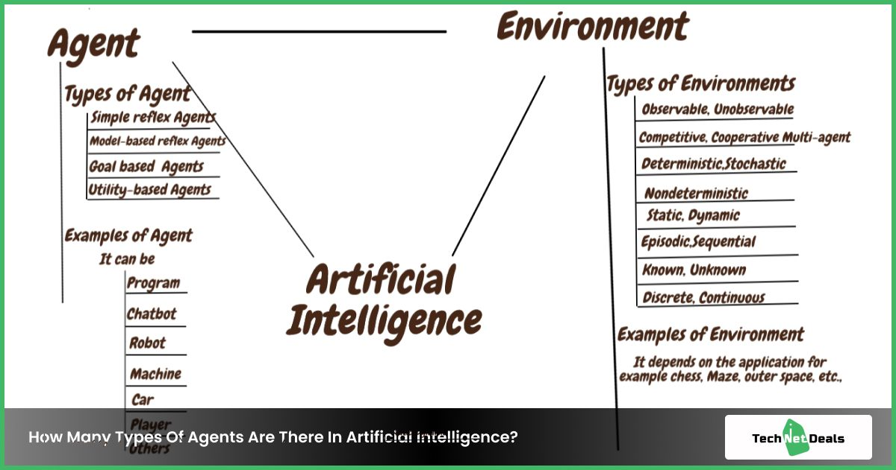

## Random Search , 

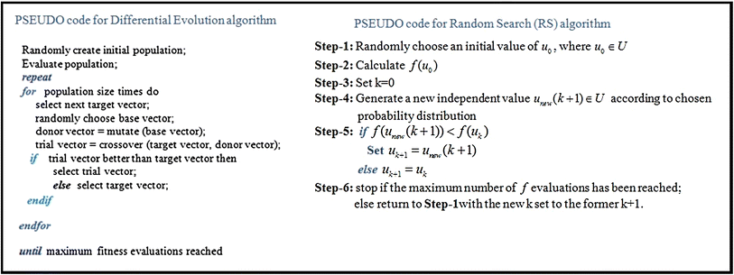
## BFS

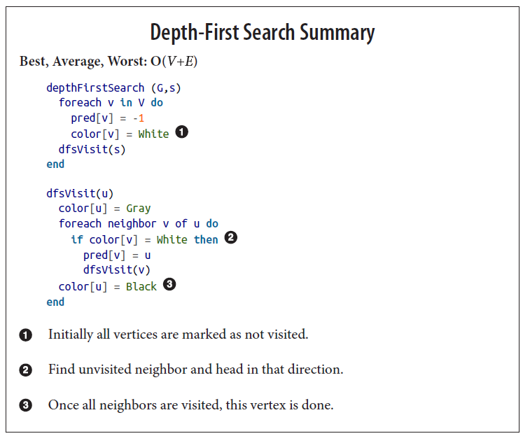

## DFS

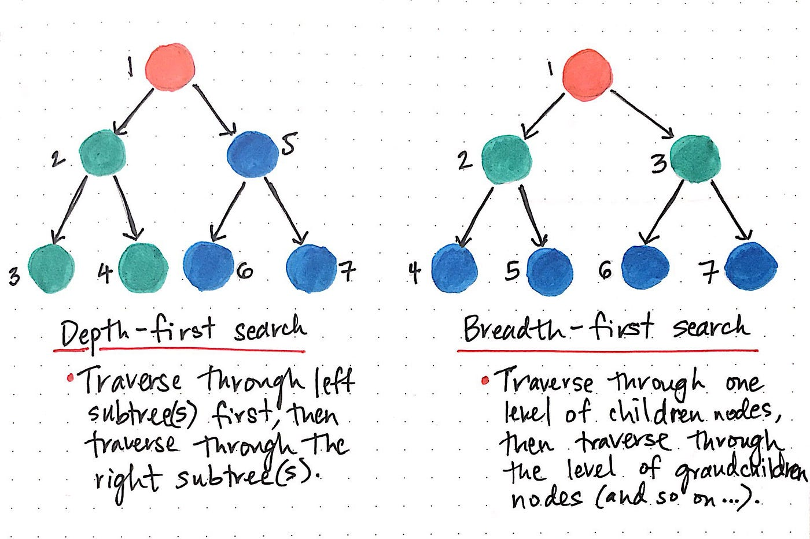

## A*

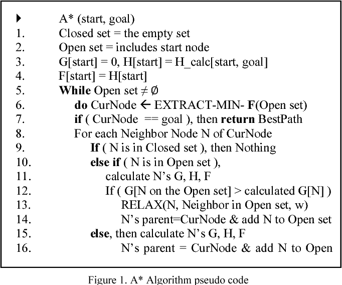

## MiniMax

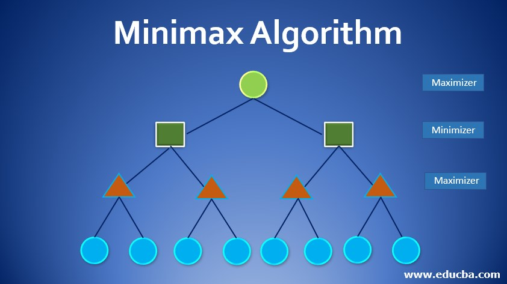

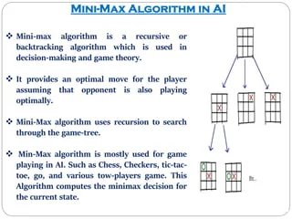

## Cost function 

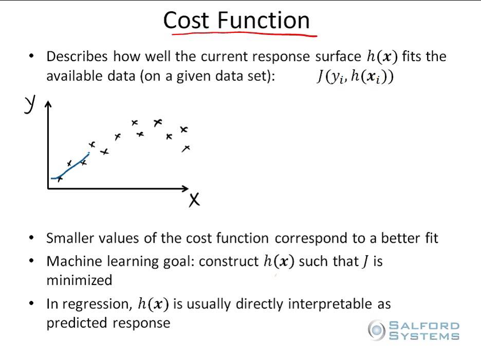

## Constraints & Satisfaction

.jpg)

## Types of agents

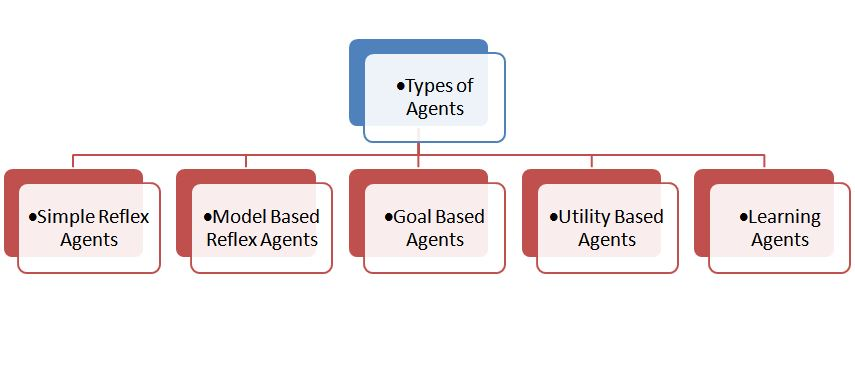

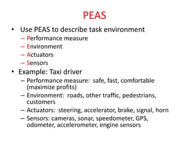

## Ucs

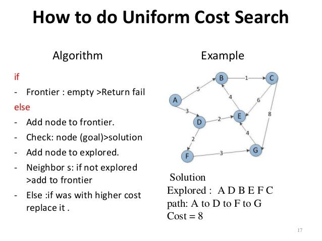

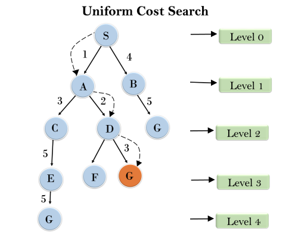

## Best First Search

![]

## Alpha Beta Pruning

## DLS

The depth-limited search (DLS) method is almost equal to depth-first search (DFS), but DLS can work on the infinite state space problem because it bounds the depth of the search tree with a predetermined limit L. Nodes at this depth limit are treated as if they had no successors.

## IDDLS

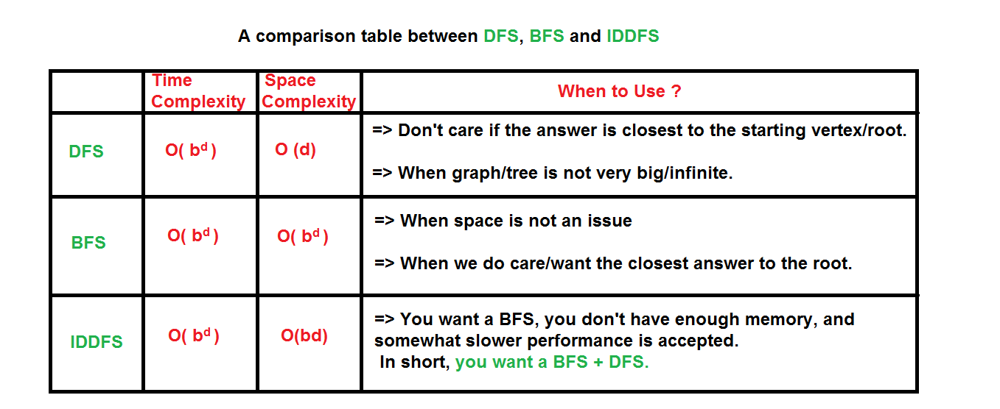

## Water Jug Problem

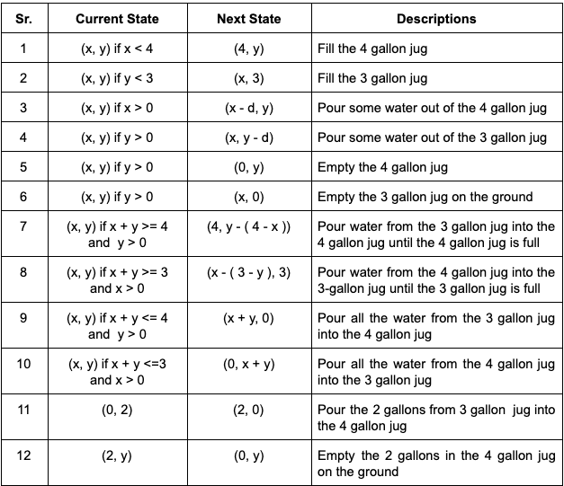

## Tower Of Hanoi

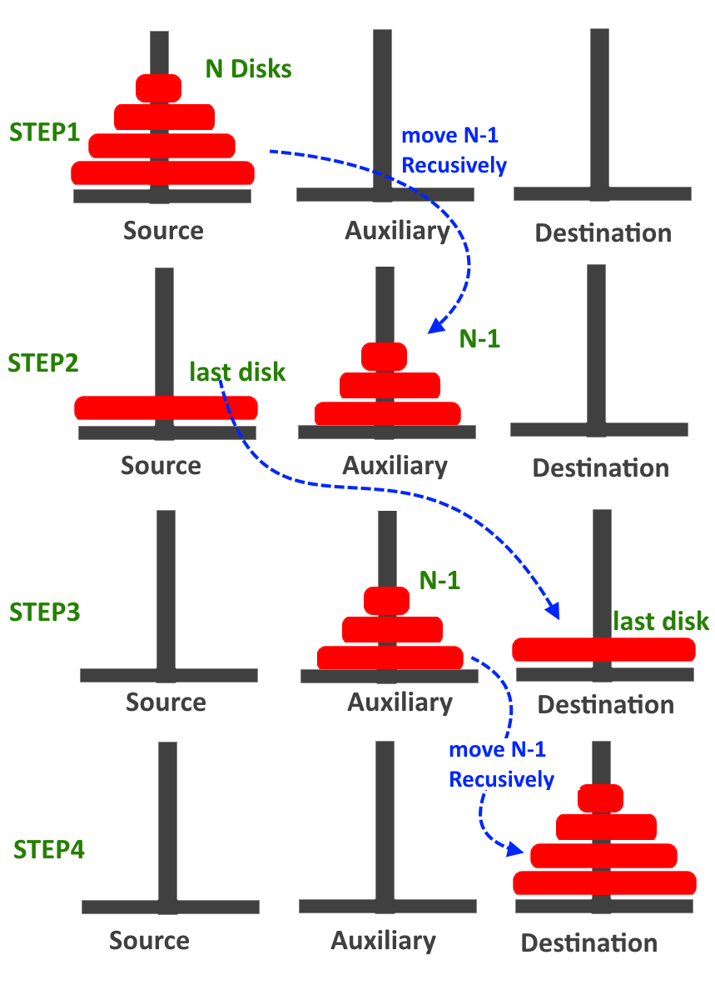

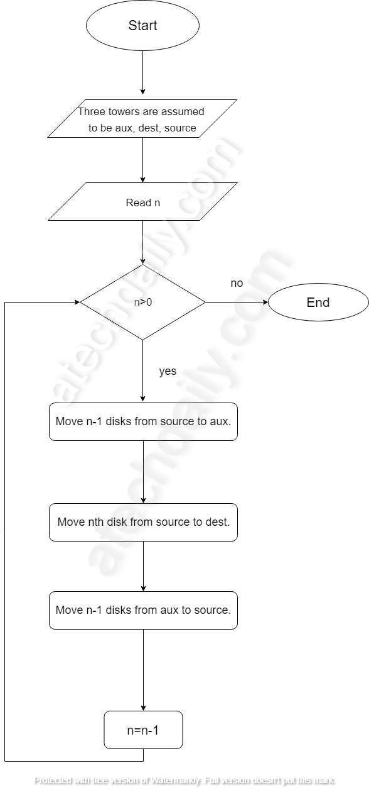

## Finding the cycle in directed/undirected

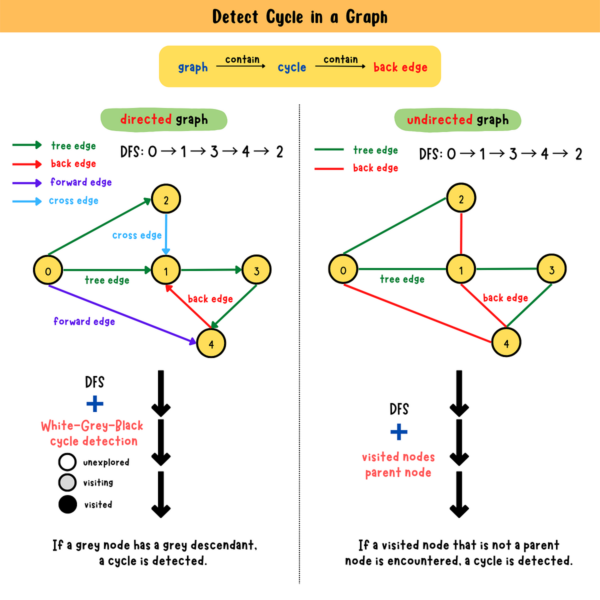

## 8 puzzle

## N queen

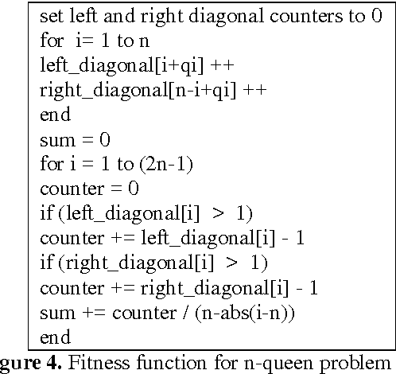

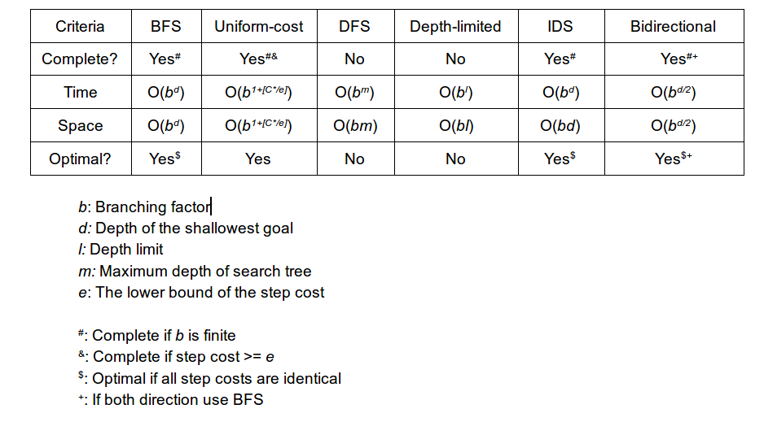
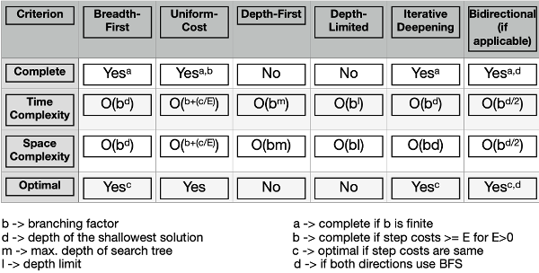
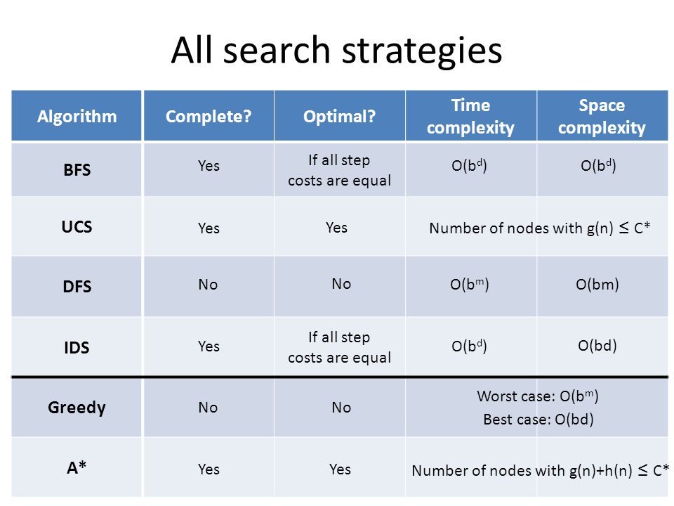