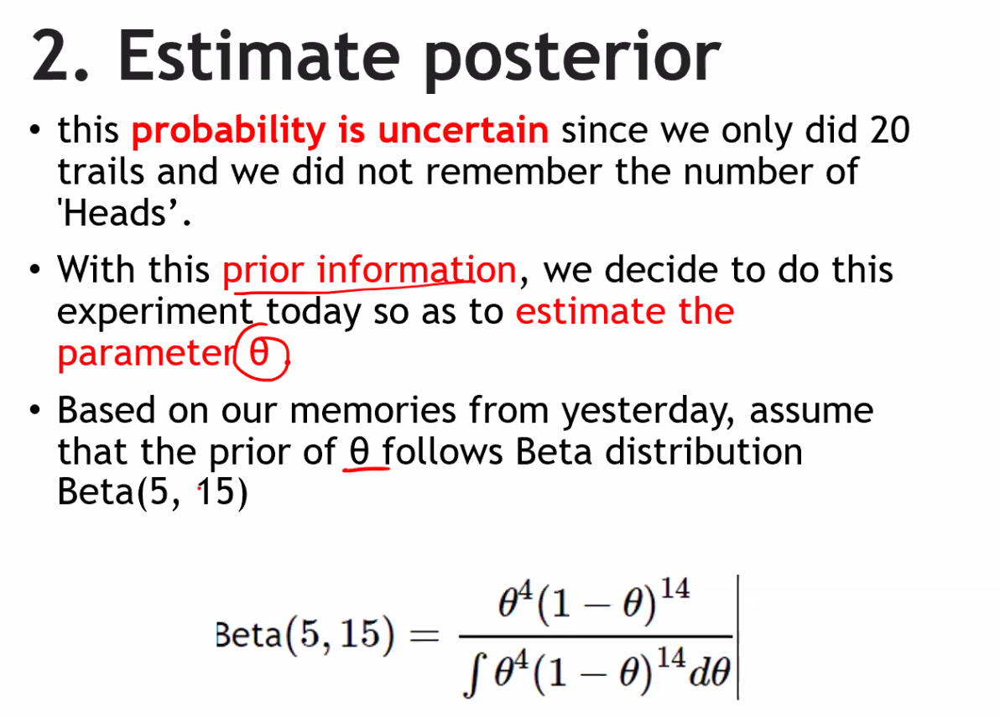
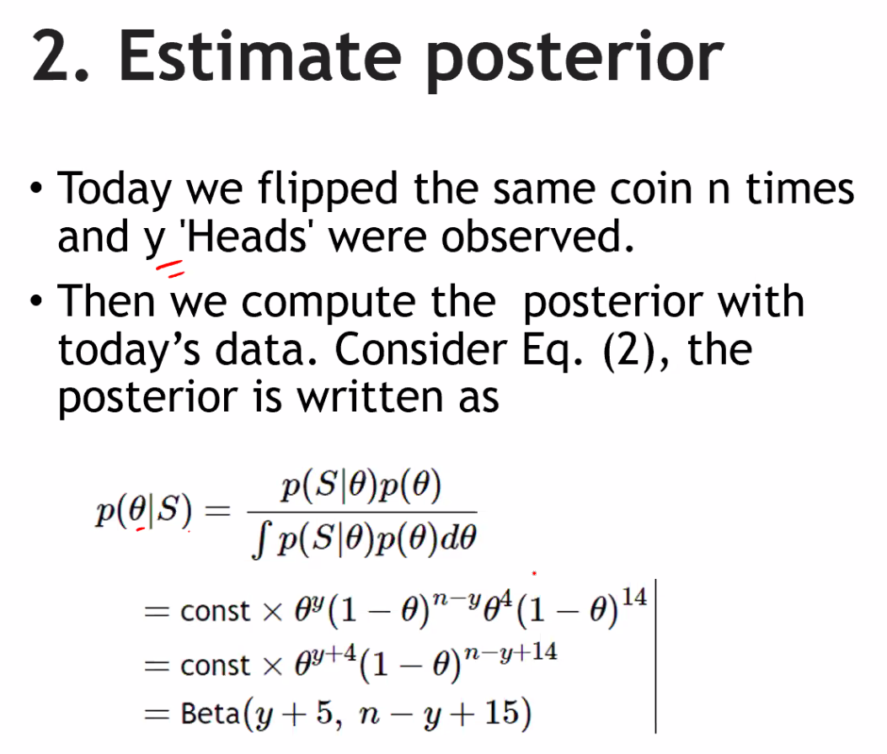

In statistics and probability theory, the posterior is a fundamental concept, especially in Bayesian statistics. It represents the updated probability distribution of a parameter or a set of parameters after taking into account observed data and prior information. The posterior distribution is a key component in Bayesian inference, which is a framework for making statistical inferences by combining prior beliefs or knowledge with new data.

Here's a more detailed explanation of the posterior distribution and how it is derived:

1. **Prior Distribution (Prior)**: Before observing any data, you start with a prior distribution, which represents your beliefs, knowledge, or uncertainty about the parameters you want to estimate. This distribution is based on prior information or expert opinions and is denoted as P(θ), where θ represents the parameters of interest.

2. **Likelihood (Data Likelihood)**: The likelihood function, denoted as P(D|θ), represents the probability of observing the data (D) given a specific set of parameter values θ. It quantifies how well the parameters explain the observed data.

3. **Posterior Distribution (Posterior)**: The posterior distribution, denoted as P(θ|D), is what you want to calculate. It represents the updated probability distribution of the parameters θ after considering both the prior information and the observed data. The posterior is calculated using Bayes' theorem:

   P(θ|D) = [P(D|θ) * P(θ)] / P(D)

   Where:
   - P(θ|D) is the posterior distribution.
   - P(D|θ) is the likelihood of the data given the parameters.
   - P(θ) is the prior distribution.
   - P(D) is the marginal likelihood or evidence, which serves as a normalization constant to ensure that the posterior integrates to 1.

The posterior distribution provides a more informed and updated view of the parameter values after incorporating the data. It combines your prior beliefs with the information contained in the observed data. The shape of the posterior distribution depends on both the prior distribution and the likelihood function.

Once you have the posterior distribution, you can use it for various purposes in Bayesian statistics, such as:

- Making point estimates of the parameters (e.g., using the posterior mean or median).
- Calculating credible intervals (analogous to confidence intervals in frequentist statistics).
- Making predictions or generating samples from the posterior to simulate data.
- Conducting hypothesis tests or model selection by comparing different models' posteriors.

In Bayesian statistics, the posterior distribution is central to making probabilistic inferences, and it provides a flexible framework for incorporating prior knowledge and updating beliefs in light of new data.