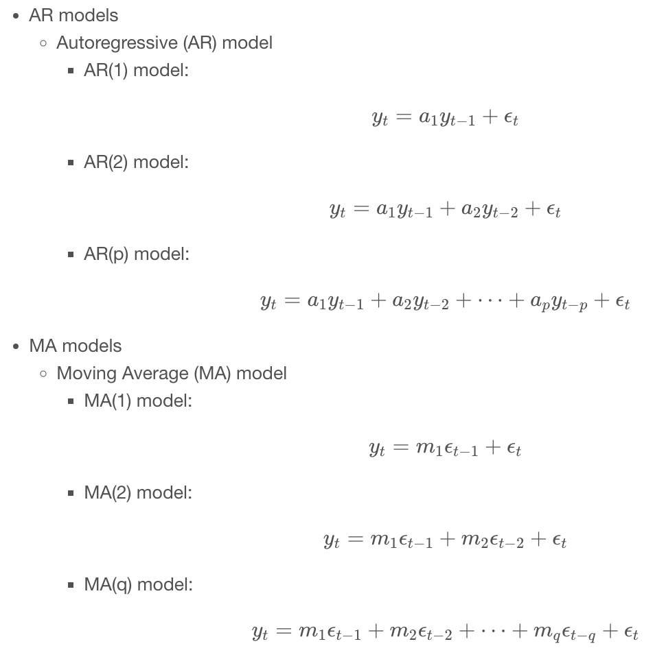

# About

**Auto Regression Moving Average** 

### usefull for 

- time series


### Applied in 

- econometrics
- statistics 

## Combines

- AutoRegrssive (AR) , relation between current value and past values


- Moving average (MA) , 




```
import pandas as pd
import numpy as np
import matplotlib.pyplot as plt
import seaborn as sns

plt.rcParams['figure.figsize'] = (10, 5)
plt.style.use('fivethirtyeight')

candy = pd.read_csv('dataset/candy_production.csv', index_col='date', parse_dates=True)

# Plot ant show the time series on axis ax
fig, ax = plt.subplots();
candy.plot(ax=ax);

candy_train = candy.loc[:'2006']
candy_test = candy.loc['2007':]

# Create an axis
fig, ax = plt.subplots();

# Plot the train and test sets on the axis ax
candy_train.plot(ax=ax);
candy_test.plot(ax=ax);
plt.savefig('.images/train_test.png')


earthquake = pd.read_csv('dataset/earthquakes.csv', index_col='date', parse_dates=True)
earthquake.drop(['Year'], axis=1, inplace=True)

earthquake

from statsmodels.tsa.stattools import adfuller

# Run test
result = adfuller(earthquake['earthquakes_per_year'])

# Print test statistic
print(result[0])

# Print p-value
print(result[1])

# Print critical values
print(result[4]) 

city = pd.read_csv('dataset/city.csv', parse_dates=True, index_col='date')

result = adfuller(city['city_population'])

# Plot the time series
fig, ax = plt.subplots();
city.plot(ax=ax);

# Print the test statistic and the p-value
print('ADF Statistic:', result[0])
print('p-value:', result[1])

city_stationary = city.diff().dropna()

# Run ADF test on the differenced time series
result = adfuller(city_stationary['city_population'])

# Plot the differenced time series
fig, ax = plt.subplots();
city_stationary.plot(ax=ax);

# Print the test statistic and the p-value
print('ADF Statistic:', result[0])
print('p-value:', result[1])

city_stationary = city.diff().diff().dropna()

# Run ADF test on the differenced time series
result = adfuller(city_stationary['city_population'])

# Plot the differenced time series
fig, ax = plt.subplots();
city_stationary.plot(ax=ax);

# Print the test statistic and the p-value
print('ADF Statistic:', result[0])
print('p-value:', result[1])

```