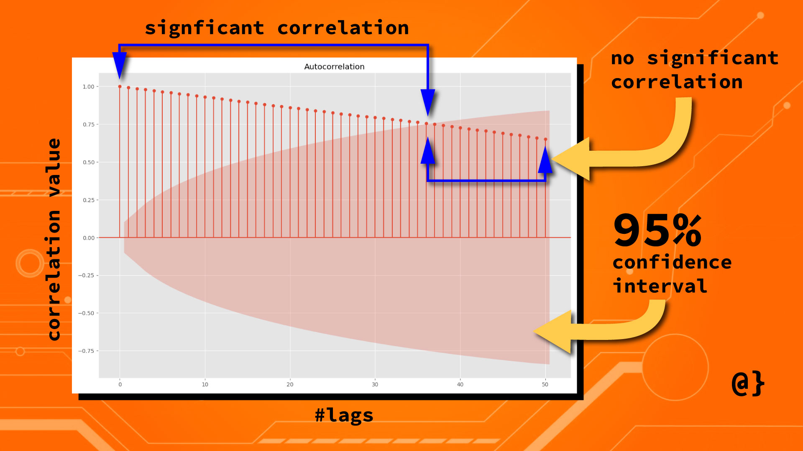

# About 

Autocorrelation estimates the influence of all past observed values on the currently observed value. This differs from partial autocorrelation in which only a single past observed value is measured for influence on the currently observed value.


- LAG , count of previous observations

- Positive Correlation , 

- Negative Correlation ,

- Confidence Interval ,

- Confidence Level , 


```

# Get Time Series Data
import pandas as pd
# Read in CSV data to Dataframe
df = pd.read_csv('TSLA.csv')
# Drop all columns but 'Date' and 'Adj Close', reindex using 'Date'
df = df[['Date', 'Adj Close']].set_index(['Date'])

#Inspect & Clean Data
df.isnull().sum()


#Perform Autocorrelation & Visualization
from statsmodels.graphics.tsaplots import plot_acf
import matplotlib.pyplot as plt


# Use the Autocorrelation function
# from the statsmodel library passing
# our DataFrame object in as the data
# Note: Limiting Lags to 50
plot_acf(data=data, lags=50)

# Show the AR as a plot
plt.show()


```



------------------------------------------------
### REFERENCES

1. https://www.alpharithms.com/autocorrelation-time-series-python-432909/